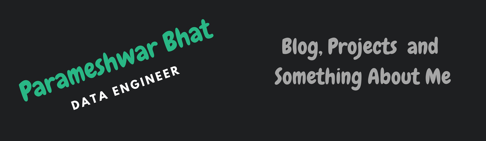

<!-- More info, tips and tricks for making GitHub Profile README can be found in my article at https://towardsdatascience.com/build-a-stunning-readme-for-your-github-profile-9b80434fe5d7 -->

<!--(https://martinheinz.dev/)-->

# Hello, folks! 

My name is Parameshwar Bhat and I'm a Data/Software engineer. I'm from India, living in Arlington, Virginia. You can find me on [![LinkedIn][3.2]][3].

## 🔧 Technologies & Tools

### Programming Languages

### DataBases

### Cloud and DevOps

### Big Data Analytics And ETL Tools

### Machine Learning

## &#x270d; Blog & Writing

Apart from coding, I also maintain a blog - you can find my articles on my medium account at [Medium](https://medium.com/@parameshwarbhat411)

## Latest Medium Article

[Latest Medium Article](https://medium.com/@parameshwarbhat411/docker-in-docker-the-good-and-the-bad-48cfe4e0da6e?source=rss-e6fc3cbf8402------2) - Docker-In-Docker: The Good And the Bad

## &#x1f4c8; GitHub Stats

<!-- links to social media icons -->

<!-- icons with padding -->

[1.1]: http://i.imgur.com/tXSoThF.png (twitter icon with padding)
[2.1]: http://i.imgur.com/0o48UoR.png (github icon with padding)

<!-- icons without padding -->

[1.2]: http://i.imgur.com/wWzX9uB.png (twitter icon without padding)
[2.2]: http://i.imgur.com/9I6NRUm.png (github icon without padding)
[3.2]: https://raw.githubusercontent.com/parameshwarbhat411/parameshwarbhat411/master/linkedin-3-16.png (LinkedIn icon without padding)

<!-- links to your social media accounts -->

[2]: https://github.com/parameshwarbhat411
[3]: https://www.linkedin.com/in/parameshwar-bhat-8a34a31b6/

<!-- Resources -->
<!-- Icons: https://simpleicons.org/ -->
<!-- GitHub Stats: https://github.com/anuraghazra/github-readme-stats -->
<!-- Emojis: https://emojipedia.org/emoji/ -->
<!-- HTML Emojis: https://www.fileformat.info/index.htm -->
<!-- Shields: https://shields.io/ -->
<!-- Awesome GitHub Profile README: https://github.com/abhisheknaiidu/awesome-github-profile-readme -->
